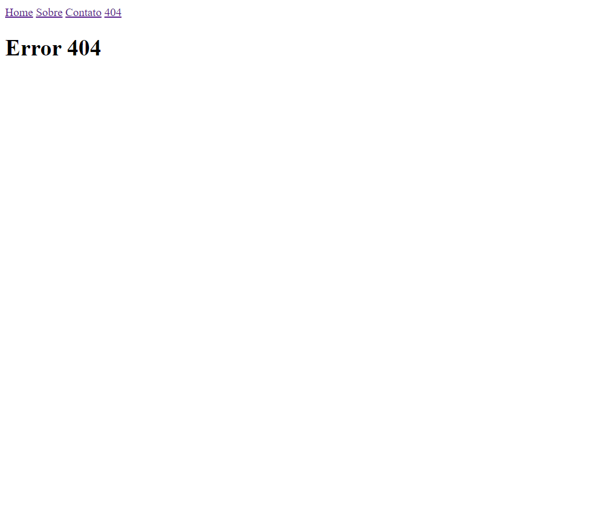

<h1 align="center"> introdução ao SPA </h1>

Introdução promovida pela rocketseat para ensino de tecnologias WEB.

  <a href="#-tecnologias">Tecnologias</a>&nbsp;&nbsp;&nbsp;|&nbsp;&nbsp;&nbsp;
  <a href="#-projeto">Projeto</a>&nbsp;&nbsp;&nbsp;|&nbsp;&nbsp;&nbsp;
  <a href="#memo-licença">Licença</a>

  

 

  

## 🚀 Tecnologias

Esse projeto foi desenvolvido com as seguintes tecnologias:

- HTML, Node.js e Javascript
- Git e Github

## 💻 Projeto

Introdução para melhorar a prática e os conhecimentos.

## 📝 Licença

Esse projeto está sob a licença MIT.